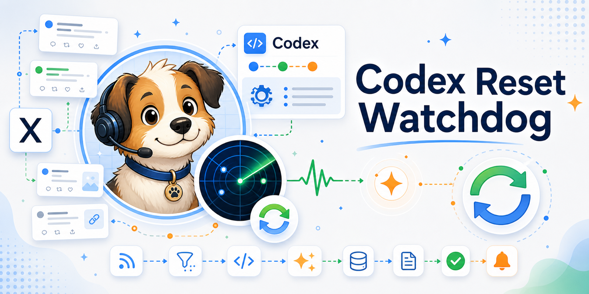
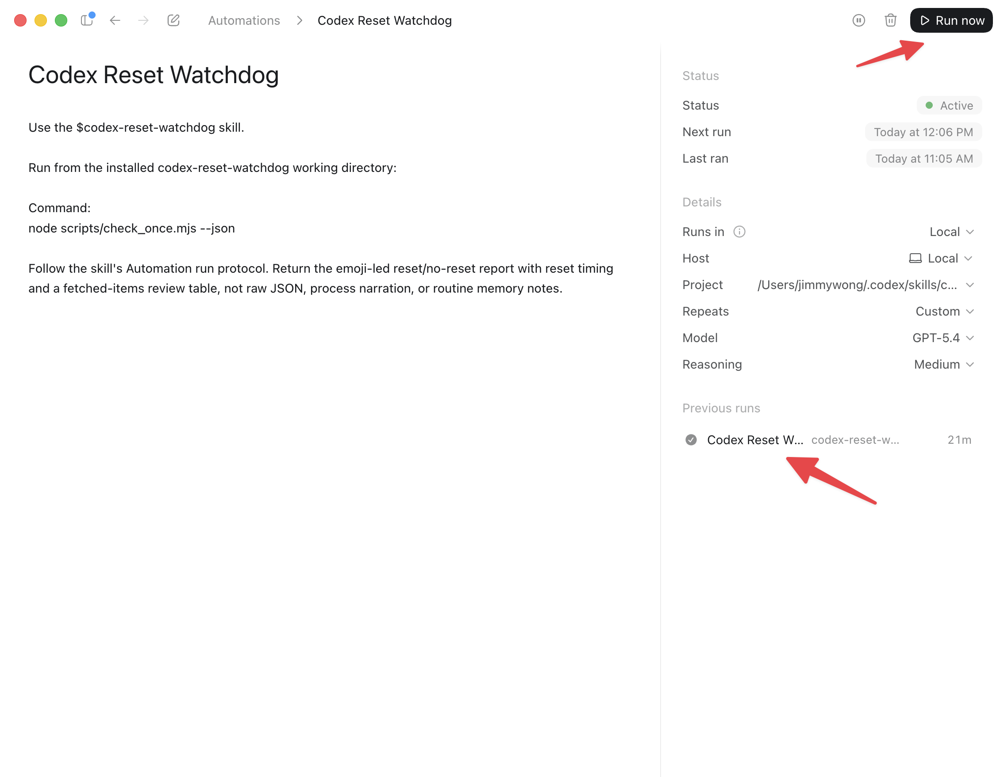
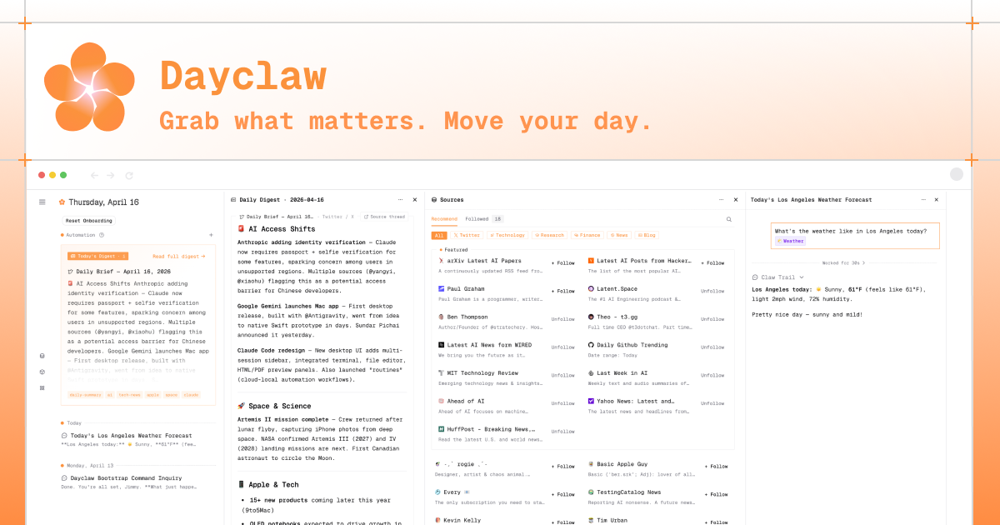

[English README](README.md)

本 skill 的主要作用是通过监控 Codex 负责人 [thsottiaux](https://x.com/thsottiaux) 在 X 上的公开动态，及时发现可能的 Codex reset 信号，并通过 Codex Automation 输出 finding，帮助用户在 reset 前得知此信息，从而更有意识地消耗订阅里的剩余额度，必要时切换 fast 模式，减少浪费。

另外，本 skill 不需要你注册任何 API ，也不会产生额外的费用（当然调用 Codex Automation 会消耗你的 Codex quota）。

## 如何使用？

### 第一步：先创建一个 Codex Project

先创建一个专门给本监控使用的 Codex Project，例如 `Codex Reset Watchdog`。

### 第二步：在 Project 里复制 prompt，安装并创建 Automation

进入刚创建的 Project，在这个 Project 里新建一个 chat，然后复制黏贴以下 prompt，Codex 会自己安装本 skill。

⚠️ 注意：不要在普通 Chat 里运行下面的 prompt。一定要在刚创建的 Project 里运行。

```text
请静默安装、初始化并启用 codex-reset-watchdog：
https://github.com/thinkingjimmy/codex-reset-watchdog

只在两种情况中途回复我：需要我授权某个操作，或遇到必须由我处理的阻塞。
除此之外，不要输出过程进度、工具参数细节、命令尝试、重试过程、原始 JSON 或 state 文件内容。请自己完成下面任务，最后只给一段简洁 setup 总结。

任务：
1. 优先使用 Codex 的 skill installation workflow 安装这个 GitHub repo，skill 名称用 codex-reset-watchdog。没有 installer 时再 clone repo。
2. 找到已安装或克隆出来的源目录，确认其中包含 SKILL.md、scripts/check_once.mjs、references/automation-prompt.md、.codex/config.toml。
3. 将运行所需文件准备到当前 workspace 根目录：SKILL.md、README.md、README.zh-CN.md、env.example、.codex/、agents/、references/、scripts/、images/。保留现有 .git，不要创建嵌套 repo，不要覆盖本地 env 或 .env。
4. 在当前 workspace 根目录确认存在 SKILL.md、scripts/check_once.mjs、references/automation-prompt.md、.codex/config.toml。
5. 在当前 workspace 根目录运行 node scripts/self_test.mjs。
6. 运行 node scripts/check_once.mjs --prime-state --json 创建基线 state。
7. 运行 node scripts/check_once.mjs --dry-run --json 确认 Dayclaw public source、JSON 解析和 state 去重正常。
8. 如果 node scripts/check_once.mjs 因 sandbox/network 权限失败，只请求允许 node scripts/check_once.mjs 这个窄入口重跑；不要请求 full access。若仍是 DNS/HTTPS 或 state 写入问题，按运行级问题总结，不要当成 reset/no-reset 结论。
9. 读取 references/automation-prompt.md 的完整内容作为 Automation prompt。
10. 使用 Codex Automation 工具创建或更新名为 Codex Reset Watchdog 的 cron/project Automation：频率每小时一次，状态 ACTIVE，execution 使用 Local，cwd/cwds 使用当前 workspace 根目录。若当前工具列表没有 Automation 工具，先搜索 automation_update。先查找同名或同 id 的现有 Automation，有则 update，不要创建重复项。若 Automation 工具仍不可用或 schema 不明确，请把它作为 setup blocker 总结，不要通过反复试错创建多个无效 Automation。
11. 最终总结只包含：运行目录、安装源目录、self-test、prime/dry-run 状态、state.path、source health、Automation 名称/状态/频率/execution/cwd/prompt 来源，以及 Run Now 预期。不要贴原始 JSON。
```

### 第三步：测试 Automation

创建完成后，在 Automation 详情页（图中 1）点击 Run Now （图中 2）测试。按照预期会在 Codex Reset Watchdog 的 Project 里看到最新的 chat 输出。



当出现可能的 reset 信号时，会出现类似如下结果（以下为示例）：

🚨 Actionable Codex reset ahead: paid ChatGPT Codex limits are scheduled to reset. Reset timing: 2026-06-03 morning (Asia/Shanghai).

| Time | Evidence | Reset timing | Actionability | Link |
| --- | --- | --- | --- | --- |
| 2026-06-02 22:15 Asia/Shanghai | Said limits are "resetting tomorrow morning". | 2026-06-03 morning | 🚨 future | https://x.com/example/status/3 |


## 想要监控更多信息？

如果你想要监控 thsottiaux 账号以外的账号，亦或者其他社交平台，如 Reddit、Hacker News 亦或者是 Product Hunt 等，你可以试试 [Dayclaw](https://dayclaw.com/)。



## FAQ

**Q: 为何不能使用普通 chat？**

因为 Codex 的 Automation 的 sandbox 限制，导致一些必要的安装、检查、state 写入等操作在普通 chat 里无法完成，所以需要使用 Project。

**Q: 如何设置时区？**

当使用默认配置时，Codex 会监控 `@thsottiaux`，把状态写到 `var/state.json`，并使用 Automation 的运行环境来展示时间。但如果你想让输出 finding 里展示符合其他时区，就需要创建一个 env 文件，覆盖默认的 `REPORT_TIMEZONE`：

1. 复制 [`env.example`](env.example)。
2. 把副本改名为 `env` 。
3. 只修改你真正需要的字段。如果要强制使用某个报告时区，把 `REPORT_TIMEZONE` 设为 IANA timezone：

```env
REPORT_TIMEZONE=America/Los_Angeles
```

常见的时区有：`Asia/Shanghai`、`America/Los_Angeles`、`America/New_York`、`Europe/London`、`Europe/Berlin`、`UTC`。

留空 `REPORT_TIMEZONE` 会使用 Automation 运行环境/用户时区。这是默认推荐方式。

## Skill 结构

这个仓库本身就是一个单 skill 目录：根目录放 `SKILL.md`，旁边放可选的 `agents/`、`references/`、`scripts/`。如果要嵌入到另一个仓库，把本目录复制到 `.agents/skills/codex-reset-watchdog/`。

```text
codex-reset-watchdog/
  .codex/
    config.toml                   # Codex 最小权限 profile
    rules/
      codex-reset-watchdog.rules  # 旧 sandbox 模式下的命令级网络兜底
  SKILL.md                         # skill 元数据和运行指令
  README.md                        # 英文说明
  README.zh-CN.md                  # 中文说明
  env.example                      # 可见配置模板
  .gitignore                       # 忽略缓存和本地状态
  agents/
    openai.yaml                    # 可选 Codex skill 展示元数据
  images/
    banner.png                     # README 顶部 banner 图
    previous-runs.png              # Automation 运行截图
  references/
    automation-prompt.md           # 创建 Codex Automation 时使用的 prompt
    deployment.md                  # 运行维护清单
    llm-judge-rubric.md            # LLM 审阅 review_items 的规则
  scripts/
    check_once.mjs                 # 零依赖 Automation 入口
    self_test.mjs                  # 本地确定性自测
```
